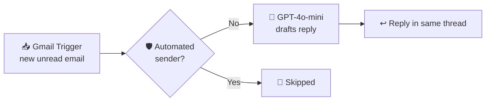

# 📧 AI Email Auto-Responder (n8n)

An **n8n** automation that watches a Gmail inbox, drafts a short professional reply to each new email with **GPT-4o-mini**, and sends it back **in the same thread**. Automated senders are filtered out, so it never gets stuck in reply loops.


## 📌 The Problem

Answering routine emails such as inquiries, confirmations and follow-ups eats up hours every week. This workflow gives every incoming message an instant, polite, context-aware reply, so senders are never left waiting.

## 🔄 How It Works



| Step | Node | What it does |
|------|------|--------------|
| 1 | **Gmail Trigger** | Polls the inbox every minute for new unread emails |
| 2 | **Skip Automated Senders** | Ignores `noreply`, `no-reply`, `mailer-daemon` and `notifications` addresses to prevent reply loops |
| 3 | **OpenAI (GPT-4o-mini)** | Reads the sender, subject and message, then writes a professional reply under 100 words |
| 4 | **Gmail Reply** | Sends the reply inside the original conversation thread |

## 🧠 Prompt Design

**System prompt**
```
You are a helpful email assistant. Write a short professional reply
under 100 words. Just the body, no subject line.
```

**User message** (filled in dynamically for each email)
```
From: {{ sender }}
Subject: {{ subject }}
Body: {{ email snippet }}
```

Keeping replies short and body-only means the output drops straight into the Gmail reply with no cleanup.

## 🚀 Setup

**Prerequisites:** an n8n instance (cloud or self-hosted), an OpenAI API key, and a Gmail account.

1. **Import the workflow.** In n8n, go to **Workflows → Import from File** and select `email-auto-responder-workflow.json`.
2. **Add credentials:**
   - **Gmail:** connect your Google account via OAuth in the *Gmail Trigger* and *Reply in Thread* nodes.
   - **OpenAI:** add your API key in the *Message a model* node.
3. **Test safely.** Before activating, send yourself an email from a second account and click **Test workflow**.
4. **Activate** the workflow. It now checks for new mail every minute.

> ⚠️ **Tip:** try this on a secondary or test inbox first. Auto-replying to *every* email on your main account can send replies to messages you didn't intend to answer.

## 🛠️ Tech Stack

- **n8n:** workflow automation
- **OpenAI GPT-4o-mini:** reply generation
- **Gmail API:** inbox monitoring and threaded replies

## ⚠️ Limitations & Future Work

- **Snippet only:** the AI sees the email's preview snippet (~200 characters), not the full body. Turning off *Simplify* in the trigger would pass the full message.
- **Human-in-the-loop:** save replies as **Gmail drafts** for review instead of sending automatically, which is safer for important inboxes.
- **Email classification:** have the AI first classify each email (inquiry, spam, urgent, newsletter) and only reply to the relevant categories.
- **Label or mark as read** after replying, to keep the inbox organized.
- **Knowledge base:** connect FAQs or company documents, RAG-style, so replies contain real answers instead of generic acknowledgements.

## 👤 Author

**Muhammad Mujtaba Khan Suri** — CS @ UBIT, University of Karachi
[GitHub](https://github.com/MMujtabaX)
